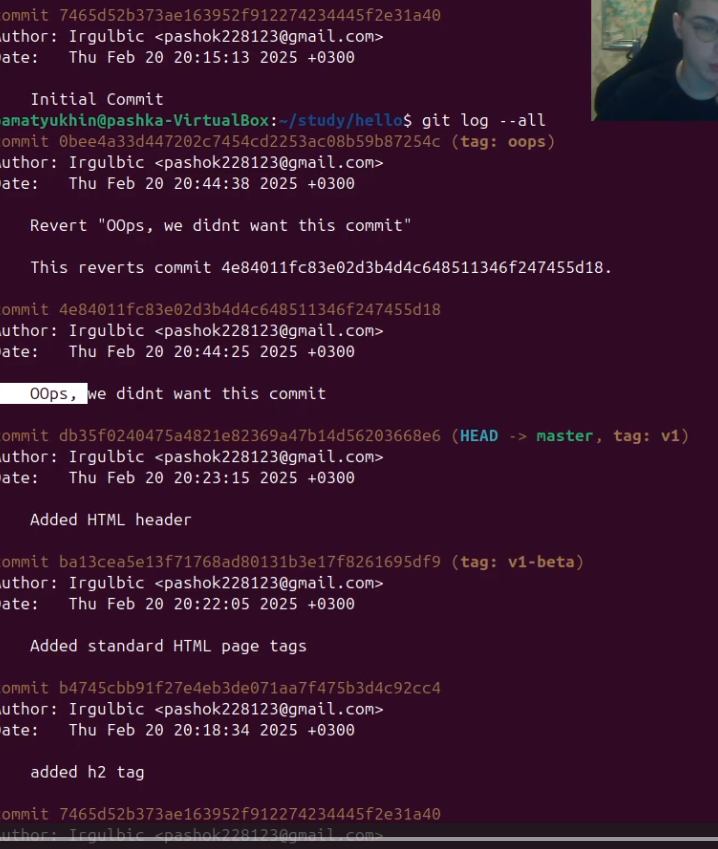

---
## Front matter
title: "Лабораторная работа №1"
subtitle: "Работа с git"
author: "Матюхин Павел"

## Generic otions
lang: ru-RU
toc-title: "Содержание"

## Bibliography
csl: pandoc/csl/gost-r-7-0-5-2008-numeric.csl

## Pdf output format
toc: true # Table of contents
toc-depth: 2
lof: true # List of figures
lot: true # List of tables
fontsize: 12pt
linestretch: 1.5
papersize: a4
documentclass: scrreprt
## I18n polyglossia
polyglossia-lang:
  name: russian
  options:
	- spelling=modern
	- babelshorthands=true
polyglossia-otherlangs:
  name: english
## I18n babel
babel-lang: russian
babel-otherlangs: english
## Fonts
mainfont: PT Serif
romanfont: PT Serif
sansfont: PT Sans
monofont: PT Mono
mainfontoptions: Ligatures=TeX
romanfontoptions: Ligatures=TeX
sansfontoptions: Ligatures=TeX,Scale=MatchLowercase
monofontoptions: Scale=MatchLowercase,Scale=0.9
## Biblatex
biblatex: true
biblio-style: "gost-numeric"
biblatexoptions:
  - parentracker=true
  - backend=biber
  - hyperref=auto
  - language=auto
  - autolang=other*
  - citestyle=gost-numeric
## Misc options
indent: true
header-includes:
  - \usepackage{indentfirst}
  - \usepackage{float} # keep figures where there are in the text
  - \floatplacement{figure}{H} # keep figures where there are in the text
---

# Цель работы

Научиться работать с git.

# Выполнение лабораторной работы

Установка имени и электронной почты 

{#fig:001 width=100%}

Создание проекта

{#fig:002 width=100%}

Внесение изменений

{#fig:003 width=100%}

Индексация изменений

{#fig:004 width=100%}

{#fig:005 width=100%}

Отмена локальных изменений (до индексации)

{#fig:006 width=100%}

Отмена проиндексированных изменений (перед коммитом)

{#fig:007 width=100%}

{#fig:008 width=100%}

Отмена коммитов

{#fig:009 width=100%}

Удаление коммиттов из ветки

{#fig:010 width=100%}

Удаление тега oops

{#fig:011 width=100%}

Внесение изменений в коммиты

{#fig:012 width=100%}

Перемещение файлов

{#fig:013 width=100%}

Второй способ перемещения файлов

{#fig:014 width=100%}

Подробнее о структуре

{#fig:015 width=100%}

Git внутри: Каталог .git

{#fig:016 width=100%}

Работа непосредственно с объектами git

{#fig:017 width=100%}

Создание ветки

{#fig:018 width=100%}

Навигация по веткам

{#fig:019 width=100%}

Изменения в ветке master

{#fig:020 width=100%}

Сделайте коммит изменений README.md в ветку master.

{#fig:021 width=100%}

Слияние

{#fig:022 width=100%}

Создание конфликта

{#fig:023 width=100%}

Разрешение конфликтов

{#fig:024 width=100%}

Сброс ветки style

{#fig:025 width=100%}

Сброс ветки master

{#fig:026 width=100%}

Перебазирование

{#fig:027 width=100%}

Слияние в ветку master

{#fig:028 width=100%}

Клонирование репозиториев

{#fig:029 width=100%}

Просмотр клонированного репозитория

{#fig:030 width=100%}

Что такое origin?

{#fig:031 width=100%}

Удаленные ветки

{#fig:032 width=100%}

Изменение оригинального репозитория

{#fig:033 width=100%}

Слияние извлеченных изменений

{#fig:034 width=100%}

Добавление ветки наблюдения

{#fig:035 width=100%}

Добавление удаленного репозитория

{#fig:036 width=100%}

Отправка изменений
{#fig:037 width=100%}

Извлечение общих изменений

{#fig:038 width=100%}

Добавление ветки наблюденияr

{#fig:039 width=100%}

# Вывод

Научился работать с git с каталогами ветками.

