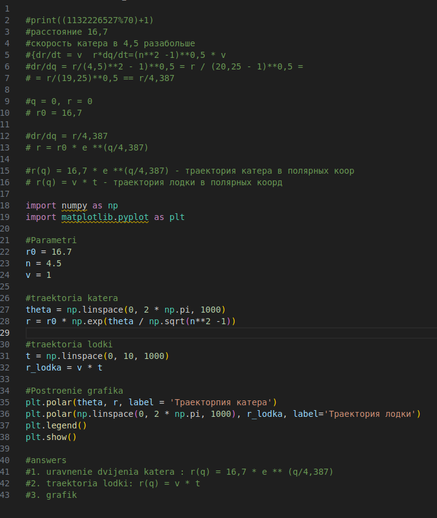
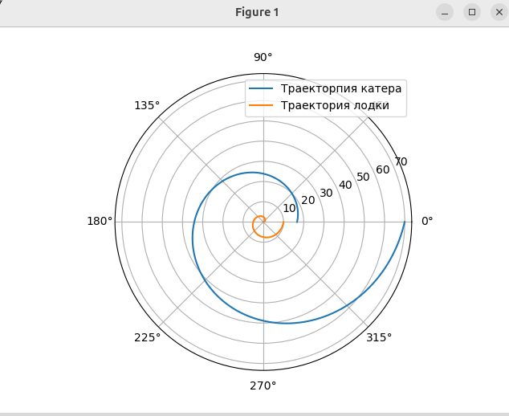
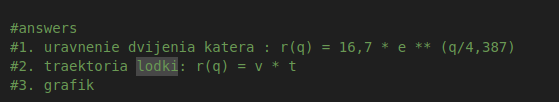

---
## Front matter
lang: ru-RU
title: Лабораторная работа №2
subtitle: Задача о погоне
author:
  - Матюхин Павел Андреевич
institute:
  - Российский университет дружбы народов, Москва, Россия
date: 5 марта 2025

## Generic otions
lang: ru-RU
toc-title: "Содержание"

## Bibliography
csl: pandoc/csl/gost-r-7-0-5-2008-numeric.csl

## Pdf output format
toc: true # Table of contents
toc-depth: 2
lof: true # List of figures
lot: true # List of tables
fontsize: 12pt
linestretch: 1.5
papersize: a4
documentclass: scrreprt
## I18n polyglossia
polyglossia-lang:
  name: russian
  options:
	- spelling=modern
	- babelshorthands=true
polyglossia-otherlangs:
  name: english
## I18n babel
babel-lang: russian
babel-otherlangs: english
## Fonts
mainfont: PT Serif
romanfont: PT Serif
sansfont: PT Sans
monofont: PT Mono
mainfontoptions: Ligatures=TeX
romanfontoptions: Ligatures=TeX
sansfontoptions: Ligatures=TeX,Scale=MatchLowercase
monofontoptions: Scale=MatchLowercase,Scale=0.9
## Biblatex
biblatex: true
biblio-style: "gost-numeric"
biblatexoptions:
  - parentracker=true
  - backend=biber
  - hyperref=auto
  - language=auto
  - autolang=other*
  - citestyle=gost-numeric
## Misc options
indent: true
header-includes:
  - \usepackage{indentfirst}
  - \usepackage{float} # keep figures where there are in the text
  - \floatplacement{figure}{H} # keep figures where there are in the text
---

# Информация

## Докладчик

:::::::::::::: {.columns align=center}
::: {.column width="70%"}

  * Матюхин Павел Андреевич
  * Студент
  * Российский университет дружбы народов
  * [1132226527@pfur.ru](mailto:1132226527@pfur.ru)

:::
::::::::::::::

## Цели и задачи

Научиться решать типовые задачи о погоне и решать уравнения

# Основная часть

## 

{#fig:001 width=50%}

## 

{#fig:002 width=50%}

## 

{#fig:003 width=50%}

## Вывод
Научился решать типовые задачи о погоне, и вспомнил решение дифуров
